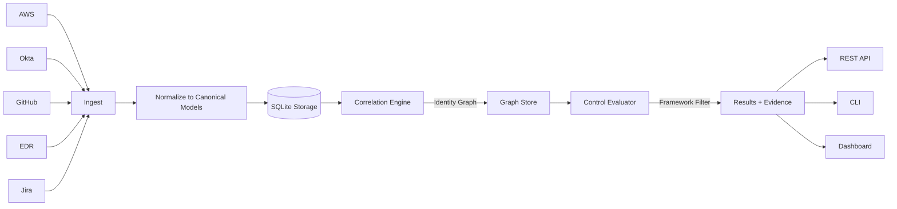

# SignalGraph

**Multi-source GRC posture platform with identity correlation and control mapping**

A portfolio-grade security data platform that ingests from multiple systems, correlates identities across sources, and maps findings to SOC 2, ISO 27001, PCI-DSS, and HIPAA controls.

---

## The Problem

Traditional GRC tools show per-system compliance checks:
- Okta: "User has MFA"
- AWS: "IAM user exists"
- GitHub: "2FA enabled"

**But real risk lives in the gaps between systems:**

- A terminated employee (deprovisioned in Okta) still has AWS keys and GitHub admin access
- An admin in GitHub isn't in the Okta "Admins" group
- A laptop without disk encryption belongs to someone with access to production S3
- A critical GuardDuty finding has no remediation ticket

These are **correlation findings** — invisible to single-system scanners, visible only after identity graph analysis.

---

## What This Platform Does

SignalGraph solves the correlation problem:

1. **Multi-source ingestion** via connector plugins (AWS, Okta, GitHub, EDR, Jira)
2. **Identity correlation** across systems using email, employee ID, and username normalization
3. **Cross-system control evaluation** that queries the correlated graph, not isolated datasets
4. **Framework-first UI** — select SOC 2, ISO 27001, PCI-DSS, or HIPAA and see controls + findings for that framework
5. **Evidence artifacts** (JSON) for every ingestion + evaluation

### Architecture



### Why a Graph?

A **correlated identity** represents the same person across multiple systems:

```
Correlated Identity: alex.rivera@example.com
├─ Okta:   active, MFA enabled, Admin group
├─ AWS:    IAM user alex.rivera, MFA enabled
├─ GitHub: alex-rivera, admin, 2FA enabled
└─ EDR:    LAPTOP-ARIVERA, encrypted, healthy sensor
```

Controls evaluate this graph:
- **MFA-001** (Admin MFA Everywhere): ✅ PASS — Alex has MFA in Okta, AWS, GitHub
- **TERM-001** (Terminated Access): ✅ PASS — Alex is active in all systems
- **ENCRYPT-001** (Endpoint Encryption): ✅ PASS — Alex's laptop is encrypted

But for Sam Williams (deprovisioned in Okta on 2026-01-05):

```
Correlated Identity: sam.williams@example.com
├─ Okta:   DEPROVISIONED (2026-01-05)
├─ AWS:    IAM user sam.williams, last used 2025-12-20
├─ GitHub: sam-williams-dev, admin, no 2FA
└─ EDR:    DESKTOP-SWILLIAMS, offline since 2025-12-18
```

- **TERM-001**: ❌ FAIL — "Deactivated in Okta but still has AWS IAM user and GitHub admin"
- **TWOFACTOR-001**: ❌ FAIL — "GitHub admin without 2FA"

**This finding only exists after correlation.** No single-system tool sees it.

---

## Framework Selection

Users select a framework (SOC 2, ISO 27001, PCI-DSS, HIPAA), and the platform scopes:
- **Control catalog** to controls mapped to that framework
- **Dashboard** to show only relevant controls and findings
- **API** to `/frameworks/{id}/controls` and `/frameworks/{id}/results`
- **CLI** `signalgraph evaluate --framework soc2`

Controls can map to multiple frameworks (crosswalk). Example:

**MFA-001** maps to:
- SOC 2: CC6.1, CC6.2
- ISO 27001: A.9.4.2, A.9.4.3
- PCI-DSS: 8.3.1, 8.3.2
- HIPAA: 164.312(a)(2)(i)

Selecting PCI shows MFA-001 with its PCI-DSS mappings. Selecting HIPAA shows the same control with HIPAA mappings. The underlying evaluation is the same; the presentation is scoped.

### Why This Matters for GRC

Auditors ask: "Show me your SOC 2 CC6.1 compliance."

Traditional answer: "Here's a spreadsheet mapping our controls to CC6.1."

SignalGraph answer: `GET /frameworks/soc2/results` → JSON with:
- Control ID, title, SOC 2 mapping
- Pass/fail status
- Failure details (which identities/assets)
- Evidence artifact paths

This is **auditor-ready, machine-readable compliance**.

---

## Demo: Fixture Company

The fixtures represent a fictional 50-person SaaS company with:
- **8 Okta users** (7 active, 1 deprovisioned)
- **5 AWS IAM users** (not all have MFA)
- **6 GitHub org members** (some admin, some missing 2FA)
- **7 endpoints** in EDR (some unencrypted, some with stale sensors)
- **4 S3 buckets** (1 public, 1 unencrypted)
- **3 GitHub repos** (1 production repo without branch protection)
- **6 Jira tickets** (some overdue, some without control links)
- **3 AWS GuardDuty findings**

### Key Findings in the Fixture Data

1. **Sam Williams** (EMP004): Deprovisioned in Okta on 2026-01-05 but still has:
   - AWS IAM user (no MFA)
   - GitHub admin access (no 2FA)
   - This triggers `TERM-001` (critical failure)

2. **Morgan Taylor** (EMP003): Active Okta user without MFA, and:
   - Laptop (LAPTOP-MTAYLOR) without disk encryption
   - Has security group membership
   - This triggers `MFA-002` and `ENDPOINT-001`

3. **Production repo `frontend-app`**:
   - Lacks branch protection
   - Admin is Sam Williams (deprovisioned user)
   - Triggers `REPO-001` and `REPO-002`

4. **S3 bucket `example-public-assets`**:
   - Publicly accessible
   - Not encrypted
   - Triggers `PUBLIC-001` and `ENCRYPT-001`

These findings demonstrate:
- **Correlation-based detections** (Sam's terminated access)
- **Cross-asset risk** (Morgan's unencrypted laptop + security access)
- **Control mapping** (same finding appears in multiple frameworks)

---

## Quick Start

### Prerequisites
- Python 3.11+
- No credentials required (fixture-based demo)

### Installation

```bash
git clone https://github.com/PrincetonBaker/signalgraph.git
cd signalgraph
pip install -e .
```

### Run the Demo

```bash
# 1. Ingest from all fixture sources
signalgraph ingest

# 2. Correlate identities
signalgraph correlate

# 3. Evaluate controls (all frameworks)
signalgraph evaluate

# 4. Evaluate for a specific framework
signalgraph evaluate --framework soc2

# 5. Generate a report
signalgraph report --framework pci --output pci-report.json

# 6. Start the API + dashboard
python -m signalgraph.api.main
# Open http://localhost:8000/dashboard
```

### What You'll See

**CLI Output:**
```
✓ Ingestion complete
  Total identities: 19
  Total assets: 14
  Total findings: 5
  Total tickets: 6

Correlating identities...
  Created 8 correlated identity groups
  Found 2 orphan identities
  Found 3 joiner-mover-leaver issues

JML Issues:
  • sam.williams@example.com: Deactivated in Okta but still active in aws
  • sam.williams@example.com: Deactivated in Okta but still has admin in github

✗ 3 critical control(s) failing
```

**Dashboard (http://localhost:8000/dashboard?framework=soc2):**
- Framework tabs: SOC 2, ISO 27001, PCI-DSS, HIPAA
- Summary: Passed / Failed / Excepted / Not Evaluated
- Control table with framework mappings
- Identity count (correlated groups)

**API Examples:**

```bash
# List frameworks
curl http://localhost:8000/frameworks

# Get SOC 2 controls
curl http://localhost:8000/frameworks/soc2/controls

# Get SOC 2 evaluation results
curl http://localhost:8000/frameworks/soc2/results

# Identity 360 view (all systems for one person)
curl http://localhost:8000/identities/corr:abc123?framework=soc2
```

---

## Connector SDK

Every connector implements:

```python
class BaseConnector(ABC):
    async def pull(self) -> ConnectorResult:
        """Fetch data and return canonical records."""
        pass
    
    async def health_check(self) -> ConnectorHealth:
        """Check if connector is healthy."""
        pass
```

**Connectors ship with:**
- Fixture adapter (always works, no credentials)
- Optional live adapter (behind env vars, never required)

**To add a new connector:**

1. Create `signalgraph/connectors/myservice.py`
2. Implement `pull()` → return `ConnectorResult(identities, assets, findings, tickets)`
3. Generate evidence JSON artifact
4. Register in `loader.py`

---

## Control Catalog

Controls live in `signalgraph/controls/catalog.yaml`:

```yaml
controls:
  - id: MFA-001
    title: Multi-Factor Authentication for Privileged Users
    description: All admins must have MFA across all systems
    frameworks:
      soc2: [CC6.1, CC6.2]
      iso27001: [A.9.4.2, A.9.4.3]
      pci: [8.3.1, 8.3.2]
      hipaa: [164.312(a)(2)(i)]
    severity: critical
    query_type: identity_mfa_admin
```

**Query types:**
- `identity_mfa_admin`: Checks correlated identities with admin flags
- `jml_leaver`: Queries correlation graph for deprovisioned + active
- `orphan_identity`: Finds identities in AWS/GitHub/EDR not in Okta
- `asset_encryption`: Filters assets by type/production and checks encryption
- `repo_branch_protection`: Checks GitHub repos for branch protection
- `finding_has_ticket`: Joins findings to tickets
- ...and 20 total controls

**To add a new control:**

1. Add to `catalog.yaml` with framework mappings
2. Implement `_evaluate_<query_type>` in `controls/evaluator.py`
3. Return `ControlResult(status, passed_count, failed_count, failure_details)`

---

## Risk Acceptance

Create `exceptions.json`:

```json
{
  "PUBLIC-001": [
    {
      "entity_id": "aws:asset:example-public-assets",
      "reason": "Marketing site, public by design",
      "approved_by": "security-team@example.com",
      "expiry": "2027-12-31T23:59:59Z"
    }
  ]
}
```

Run with `--exceptions exceptions.json`. Excepted controls show `EXCEPTION` status instead of `FAIL`.

---

## CI/CD Integration

The GitHub Action (`.github/workflows/grc-evaluation.yml`) runs on every push:

```yaml
steps:
  - Ingest from fixtures
  - Correlate identities
  - Evaluate controls for each framework (matrix)
  - Upload reports + evidence as artifacts
  - Fail if critical controls fail
```

Exit codes:
- **0**: All controls pass or excepted
- **1**: Critical control failure

---

## Comparison to Existing Tools

| Feature | Vanta | Drata | Secureframe | **SignalGraph** |
|---------|-------|-------|-------------|----------------|
| Per-system checks | ✅ | ✅ | ✅ | ✅ |
| Identity correlation | ❌ | ❌ | ❌ | ✅ |
| Cross-system controls | ❌ | Partial | ❌ | ✅ |
| Orphan detection | ❌ | ❌ | ❌ | ✅ |
| JML checks | Basic | Basic | Basic | ✅ Graph-based |
| Custom connectors | Limited | Limited | No | ✅ Plugin SDK |
| Framework selector | ✅ | ✅ | ✅ | ✅ First-class |
| Evidence artifacts | ✅ | ✅ | ✅ | ✅ JSON per run |
| Self-hosted | ❌ | ❌ | ❌ | ✅ |
| Open source | ❌ | ❌ | ❌ | ✅ MIT |

**Vanta Custom Tests** let you write checks, but:
- No built-in correlation engine
- No identity graph
- No cross-system queries

SignalGraph is the correlation engine Vanta custom tests need.

---

## Interview Talking Points

### For Senior GRC Engineer Roles

1. **"How do you ensure terminated employees lose all access?"**
   - "I built an identity correlation engine that maps the same person across Okta, AWS, GitHub, and EDR. When someone is deprovisioned in Okta, the platform checks every correlated identity. If AWS keys or GitHub admin remain active, it's a critical finding that feeds into TERM-001 (Terminated Access), mapped to SOC 2 CC6.2, ISO 27001 A.9.2.6, and PCI-DSS 8.1.4."

2. **"How do you handle control crosswalks between frameworks?"**
   - "Controls map to multiple frameworks in YAML. A single MFA control evaluation appears in SOC 2 as CC6.1, in ISO 27001 as A.9.4.2, and in PCI-DSS as 8.3.1. The UI, API, and CLI let you select a framework and see a scoped view. The underlying data and evaluation are the same; the presentation adapts."

3. **"How do you make compliance auditable?"**
   - "Every ingestion and evaluation generates JSON evidence artifacts with timestamps, source data, and evaluation results. The API exposes framework-filtered controls and findings as structured data. An auditor can `curl /frameworks/soc2/results` and get machine-readable proof of compliance, not a screenshot of a dashboard."

### For Security Engineer Roles

1. **"Describe a complex security problem you've solved."**
   - "GRC tools miss correlation findings — risks that only appear when you join data across systems. I built a graph-based platform that correlates identities by email, employee ID, and normalized usernames, then evaluates controls against the graph. For example, a deprovisioned Okta user with standing AWS access is invisible to AWS-only scanners but critical in a correlated view."

2. **"How would you detect an orphan AWS IAM user?"**
   - "Orphan detection: load all Okta active users' emails and employee IDs, then scan AWS IAM users. Any IAM user whose email or employee ID isn't in the Okta set is an orphan. This triggers ORPHAN-001, which maps to SOC 2 CC6.2 and PCI-DSS 8.1.1."

3. **"How do you prioritize security findings?"**
   - "Controls have severity (critical/high/medium/low). Critical controls block CI on failure. The evaluator also tracks SLA compliance for tickets: critical findings must have tickets resolved within 7 days. A critical GuardDuty finding without a ticket is an immediate escalation."

---

## Technical Highlights

- **Python 3.11+** with pydantic for type-safe canonical models
- **SQLite** for local storage (easily swappable to Postgres)
- **Async connectors** for concurrent ingestion
- **Typer CLI** for operator workflows
- **FastAPI + Jinja2** for REST API + dashboard
- **YAML control catalog** for easy auditing
- **Pytest** with fixture-based tests (no mocks)
- **GitHub Actions** for continuous evaluation
- **MIT license**

---

## Project Structure

```
signalgraph/
├── models/          # Pydantic canonical models
├── connectors/      # Plugin-based connectors
│   ├── base.py
│   ├── okta.py
│   ├── aws.py
│   ├── github.py
│   ├── edr.py
│   └── jira.py
├── storage/         # SQLite database layer
├── correlation/     # Identity graph + orphan/JML detection
├── controls/        # Control catalog + evaluator
│   ├── catalog.yaml
│   ├── loader.py
│   └── evaluator.py
├── cli/             # Typer CLI
├── api/             # FastAPI REST + dashboard
└── templates/       # Jinja2 templates

fixtures/            # Fixture datasets (no credentials)
tests/               # Pytest tests
evidence/            # Generated evidence artifacts (gitignored)
```

---

## Future Enhancements

- **Live adapters** for connectors (AWS boto3, Okta API, GitHub GraphQL)
- **Postgres backend** for multi-tenant deployments
- **Webhook ingest** for real-time updates
- **RBAC** for multi-user access
- **Alert routing** (PagerDuty, Slack)
- **Drift detection** (compare consecutive evaluations)
- **Custom control DSL** (user-defined queries without Python)

---

## Why This Matters

Compliance is not a checkbox. It's a continuous posture question: **"Are we safe right now?"**

Single-system scanners answer: "This system is safe."

SignalGraph answers: **"These people, across all systems, meet these controls."**

That's the difference between compliance theater and actual security.

---

## License

MIT License. See [LICENSE](LICENSE).

---

## Contact

**Princeton Baker**  
Security Engineer | GRC Platform Engineer

- GitHub: [@PrincetonBaker](https://github.com/PrincetonBaker)
- Portfolio: `ai-comply`, `pci-mentor`, `signalgraph`

---

## Acknowledgments

This platform is a hiring artifact demonstrating:
- Multi-system integration
- Identity correlation at scale
- Control mapping to real frameworks
- Production-ready code structure
- Fixture-driven testing

If you're hiring for Senior GRC Engineer or Security Engineer roles and you need someone who can build the tooling compliance teams actually need — not just use existing tools — let's talk.
